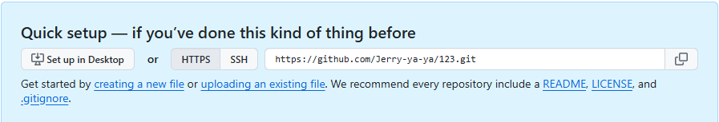

# Git & GitHub #

## 版本控制 (Version Control) ##

在軟體開發過程中，版本控制 (Version Control) 扮演核心角色。Git 作為分散式版本控制系統，不僅能記錄程式碼的歷史，更能讓團隊在不同分支上同時開發，最後再合併成果。 

## 透過 Git，我們能： ##

- 追蹤變更：每一次提交 (commit) 都能保存當下的程式碼狀態。
- 管理分支：開發新功能、修復錯誤，都可以在獨立分支上進行，降低衝突風險。
- 靈活協作：開發者能推送 (push) 程式碼至遠端，透過Pull Request 進行程式碼審查(Code Review)，確保品質並促進協作。

## GitHub ##

GitHub 不僅是程式碼倉庫，也是一個協作平台。除了版本控制，它還提供Issue 管理、專案看板、CI/CD 整合 (GitHub Actions) 等功能，使團隊能在同一平台上完成從開發到部署的流程。

## 教學紀錄 ##

https://youtu.be/zfXo3YreHB4

# 初始化跟第一次上傳 #

## Git 倉庫初始化 & 第一次提交 ##

### Windows ###
在 https://git-scm.com 下載並且安裝

or

### Macs ###
Homebrew:
```bash
brew install git
```
or

MacPorts:
```bash
sudo port install git
```

## 檢查是否安裝 & 檢查安裝版本 ##

```bash
git --version
```

## 本地資料夾初始化 ##

```bash
git init
```

## 建立遠端Github 倉庫 ##
登入Github

點選畫面左邊綠色的New


幫新倉庫取名字
可以用的名字會在下方綠色提醒(123 is available.)


其他不用動按建立倉庫


## 連接遠端Github倉庫 ##
建立好倉庫會在倉庫主頁看到這塊藍色的區域
將右邊HTTPS的部分複製起來


將下面的連結替換成剛剛複製的倉庫連結
```bash
git remote add origin https://github.com/你的帳號/你的repo.git
```

## 加入所有變更##

```bash
git add .
```

## 提交變更至本地版本庫 ##
實作專案的時候請把 What did you do. 改成這次的更新做了什麼
```bash
git commit -m "What did you do."
```

## 把目前所在的分支（通常是 master）改名為 main ##

```bash
git branch -M main
```

## 初次推送並設定 Upstream ##

```bash
git push -u origin main
```

## 📮 日常更新 ##
```bash
git add .
```
```bash
git commit -m "Type what you did."
```
```bash
git push
```

# 找到你想要挑的 commit ID #
```bash
git log --oneline
```

# 回到上一個 commit #
取消最後一次 commit，但保留修改
```bash
git reset --soft HEAD~1
```
取消最後一次 commit，但保留檔案變更（未暫存）
```bash
git reset --mixed HEAD~1
```
整個回到上個版本，檔案內容也復原
```bash
git reset --hard HEAD~1
```

# 覆蓋遠端 #
- 沒改寫歷史（沒有 rebase/ amend/ reset）：
- → 用 一般 push。
```bash
git push
```
- 剛做完 rebase / amend / reset，需要更新遠端：
- → 優先 --force-with-lease。
```bash
git push origin main --force
```
- 🚨個人倉庫或臨時分支，只有你一個人用：
- → 可接受 --force，但仍建議習慣 --force-with-lease。
```bash
git push --force-with-lease
```

# Branch operation #
## 查看所有分支 ##
```bash
git branch -a
```

## Add new branch and track to remote branch ##
```bash
git switch --track origin/New_branch
```

## 切到你想要加進去的分支 ##
```bash
git switch main
```

## 刪除已不存在的遠端分支 ##
```bash
git fetch -p
```

## 刪除本地分支 ##
```bash
git branch -d 分支名
```

## 強制刪除本地分支 ##
```bash
git branch -D 分支名
```

## 抓遠端最新 ##
- 只同步遠端資訊
```bash
git fetch
```
- 更新當前分支（自動合併，可能多一個 commit）
```bash
git pull
```
- 更新當前分支（線性歷史，乾淨）
```bash
git pull --rebase
```